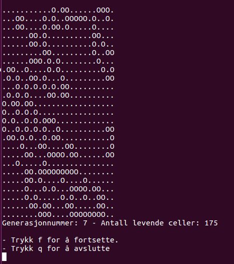

# Game of Life
> Dette prosjektet ble gjennomført på starten av studieløpet mitt.
> Programmet simulerer cellers liv og død ved hjelp av Conway's Game of Life modellen.
> Kjøring av main.py starter spillet.

- Levende celler er representert med "O" og døde celler er representert med ".".
- Eksempelkjøring (dimensjoner 25x25, etter 7 generasjoner):  
  
  
