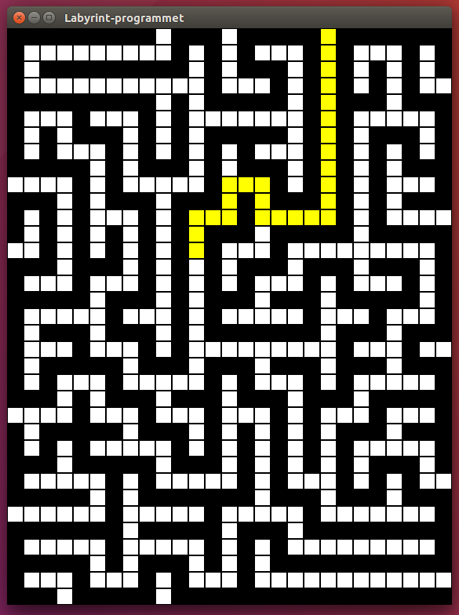

# Labyrint
> Dette prosjektet ble gjennomført i starten av studieløpet mitt. I dette prosjektet brukes
> rekursjon til å lage et program som er i stand til å finne
> veien ut av en asyklisk labyrint. Labyrintene er rutenett, bygget opp av kvadratiske
> ruter som man enten kan gå gjennom eller ikke.
> JavaFX brukes for å lage et grafisk brukergrensesnitt (GUI).

- Programmet startes ved å skrive inn denne kommandoen der JavaFX er installert:
  ```
  java LabyrintGUI
  ```
- Åpne en av labyrintfilene (.in filene) for å få opp en GUI representasjon av labyrinten.
- Trykk på en hvit rute for å få en mulig utvei fra denne ruten fargelagt.
- Eksempelkjøring (en mulig utvei ble fargelagt etter at jeg trakk på en hvit rute):  
  
  
